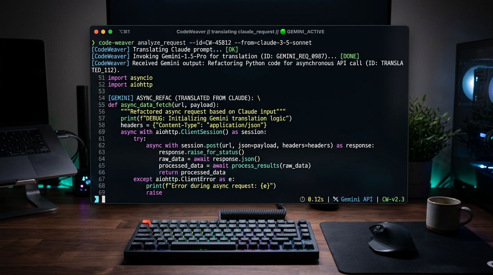

# CodeWeaver

Run Claude Code using your Gemini CLI subscription.

No Anthropic subscription.
No Gemini API key.
No Vertex AI.
Just your Google login.

---

[](https://opensource.org/licenses/MIT)
[](https://nodejs.org)
[](#features)
[](#features)
[](#features)
[](#features)

CodeWeaver is a local compatibility layer that enables Claude Code to use an authenticated Gemini CLI session (Google OAuth) as its backend model provider. It translates Anthropic-compatible requests into Gemini CLI requests while preserving streaming, tool use, and the Claude Code workflow.

Claude Code is one of the best AI coding agents available, but it normally requires Anthropic access. This project allows Claude Code to run on top of an authenticated Gemini CLI session using a local protocol translation layer, without requiring Gemini API keys or Vertex AI.

---

## Why CodeWeaver?

| Feature | Anthropic | This Project |
| --- | --- | --- |
| Claude Code UX | Yes | Yes |
| Gemini CLI OAuth | No | Yes |
| Gemini API Key | Required | No |
| Google Login | No | Yes |
| Local Execution | No | Yes |

---

## Architecture

```text
Claude Code
      │
      ▼
   CodeWeaver
      │
      ▼
 Gemini CLI (OAuth)
      │
      ▼
 Google Gemini
```

---

## Demo



---

## Installation

### One-Line Install (macOS / Linux / WSL)

Install CodeWeaver instantly:

```bash
curl -fsSL https://raw.githubusercontent.com/sai21-learn/claude-gemini-proxy/main/install.sh | bash
```

This installs CodeWeaver to `~/.codeweaver` and creates an executable symlink in `~/.local/bin/codeweaver`.

### Manual Install (All Systems)

Alternatively, clone the repository and run the setup commands:

```bash
git clone https://github.com/sai21-learn/claude-gemini-proxy.git
cd claude-gemini-proxy
node proxy.js --login
node proxy.js
claude
```

---

## Quick Start

### 1. Authenticate with Google
Run the setup authentication flow to log in to your Google Account:

```bash
codeweaver --login
```
*(If manual install: `node proxy.js --login`)*

This spins up a local server on port 8085, displays a Google sign-in link, and writes your credentials to a local config file upon authentication.

### 2. Start the Proxy Server
Launch the server to listen for local agent traffic:

```bash
codeweaver
```
*(If manual install: `node proxy.js`)*

### 3. Route Claude Code to CodeWeaver
Add the endpoint overrides to your Claude Code settings at `~/.claude/settings.json` (or `%USERPROFILE%\.claude\settings.json` on Windows):

```json
{
  "env": {
    "ANTHROPIC_BASE_URL": "http://127.0.0.1:8099/v1",
    "ANTHROPIC_AUTH_TOKEN": "sk-dummy-key-for-local-proxy",
    "CLAUDE_CODE_DISABLE_NONESSENTIAL_TRAFFIC": "1"
  },
  "model": "claude-3-5-sonnet-20241022",
  "smallFastModel": "claude-3-5-sonnet-20241022"
}
```

Now, launch Claude Code:

```bash
claude
```

---

## How It Works

CodeWeaver acts as a stateless, light, local translator intercepting HTTP requests:

```text
Claude Code ──> Anthropic API request ──> CodeWeaver (Local Translator) ──> Gemini Request ──> Google ──> Response Translation ──> Claude Code
```

1. **Protocol Translation:** Standardizes the nested, multi-turn role structures (user, assistant, tool_use, tool_result) from Anthropic format to Google Cloud Code Assist format.
2. **Schema Sanitization:** Rewrites JSON parameters for tool declaration on the fly to meet strict OpenAPI schema rules, stripping keywords like `$schema`, `exclusiveMinimum`, and `propertyNames` which cause API calls to fail.
3. **Automatic Fallbacks:** If a query hits Google's strict model quotas (`429 Rate Limit`), CodeWeaver immediately and silently redirects the chunk request to a high-capacity Flash model (`gemini-2.5-flash`) within milliseconds.

---

## Features That Work Today

- **Google OAuth Support:** Full integration with Gemini CLI credentials.
- **No API Keys Needed:** Operates completely inside your standard CLI subscription session.
- **Streaming Responses:** Near-instant token-by-token streaming delivery.
- **Automatic Token Refreshing:** Keeps OAuth tokens valid by refreshing sessions transparently in the background.
- **Zero Runtime Dependencies:** Built 100% using native Node.js core libraries.
- **Cross-Platform:** Works natively on macOS, Linux, and Windows.

---

## Roadmap

### Current
- [x] Claude Code to Gemini CLI translation

### Planned
- [ ] Plugin-based provider architecture
- [ ] Multiple Gemini account support
- [ ] Ollama backend support
- [ ] OpenAI backend support
- [ ] OpenRouter backend support
- [ ] DeepSeek backend support
- [ ] Qwen backend support
- [ ] LM Studio backend support
- [ ] Auto provider failover
- [ ] Native platform installer binaries
- [ ] Docker image containerization
- [ ] Web settings dashboard

### Vision

CodeWeaver aims to become a universal backend compatibility layer for AI coding agents, allowing developers to choose their preferred agent UX and LLM provider independently.

---

## Advanced Configurations & System Integration

### Configuration Locations

The proxy resolves authentication credentials automatically based on your host operating system:

| Operating System | Default Configuration Location |
| --- | --- |
| **Linux** | `$HOME/.pi/agent/auth.json` |
| **macOS** | `$HOME/.pi/agent/auth.json` |
| **Windows** | `%USERPROFILE%\.pi\agent\auth.json` |

Placing a `config.json` file in the same directory as `proxy.js` overrides these paths to run CodeWeaver in a local, self-contained workspace.

### Run on Startup (Background Processes)

#### Linux (Systemd User Service)

Create a systemd service file at `~/.config/systemd/user/codeweaver.service`:

```ini
[Unit]
Description=CodeWeaver Local Proxy Server
After=network.target

[Service]
ExecStart=/usr/bin/node /home/whysooraj/claude-gemini-proxy/proxy.js
Restart=on-failure

[Install]
WantedBy=default.target
```

Enable and start the service:

```bash
systemctl --user daemon-reload
systemctl --user enable --now codeweaver.service
```

#### macOS (Launchd Agent)

Create an agent Plist at `~/Library/LaunchAgents/com.user.codeweaver.plist`:

```xml
<?xml version="1.0" encoding="UTF-8"?>
<!DOCTYPE plist PUBLIC "-//Apple//DTD PLIST 1.0//EN" "http://www.apple.com/DTDs/PropertyList-1.0.dtd">
<plist version="1.0">
<dict>
    <key>Label</key>
    <string>com.user.codeweaver</string>
    <key>ProgramArguments</key>
    <array>
        <string>/usr/local/bin/node</string>
        <string>/path/to/claude-gemini-proxy/proxy.js</string>
    </array>
    <key>RunAtLoad</key>
    <true/>
    <key>KeepAlive</key>
    <true/>
</dict>
</plist>
```

Load and start the agent:

```bash
launchctl load ~/Library/LaunchAgents/com.user.codeweaver.plist
```

#### Windows (Silent VBScript Launcher)

To run the proxy silently on startup, create a VBScript file named `codeweaver.vbs`:

```vbs
Set WshShell = CreateObject("WScript.Shell")
WshShell.Run "node C:\path\to\claude-gemini-proxy\proxy.js", 0, false
```

Place this file in your Windows Startup folder (`shell:startup` in run command).

---

## Troubleshooting

#### Port in use error (EADDRINUSE)

If port 8099 is bound by another active process, find and kill it:

**Linux / macOS:**

```bash
kill $(lsof -t -i:8099)
```

**Windows (PowerShell):**

```powershell
Stop-Process -Id (Get-NetTCPConnection -LocalPort 8099).OwningProcess -Force
```

#### API Error: 429 Resource Exhausted

Google Code Assist Pro models have strict quotas. If you hit this limit, the proxy's self-healing fallback will automatically retry the request using gemini-2.5-flash in the background, allowing the operation to succeed.

---

## License

Distributed under the MIT License. See `LICENSE` for more information.
